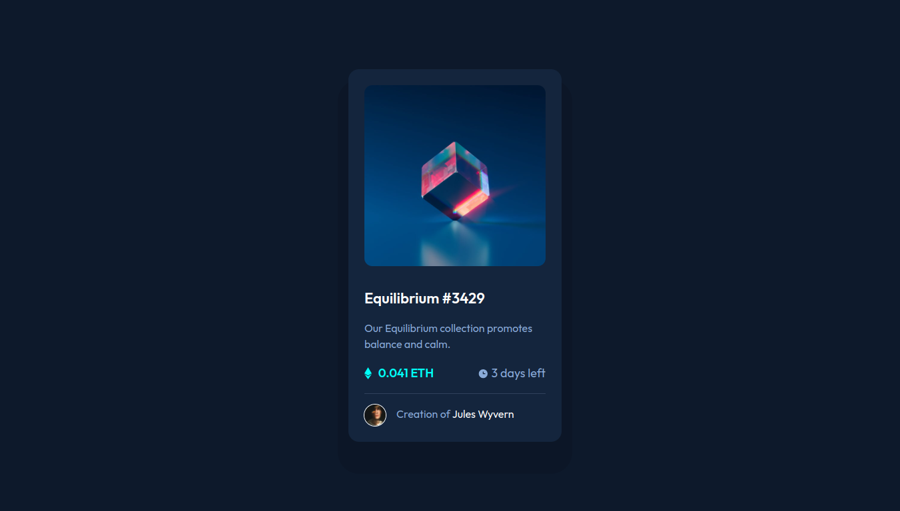

# Frontend Mentor - NFT preview card component solution

This is a solution to the [NFT preview card component challenge on Frontend Mentor](https://www.frontendmentor.io/challenges/nft-preview-card-component-SbdUL_w0U). Frontend Mentor challenges help you improve your coding skills by building realistic projects.

## Table of contents

- [Overview](#overview)
  - [The challenge](#the-challenge)
  - [Screenshot](#screenshot)
  - [Links](#links)
- [My process](#my-process)
  - [Built with](#built-with)
  - [What I learned](#what-i-learned)
  - [Continued development](#continued-development)
- [Author](#author)

**Note: Delete this note and update the table of contents based on what sections you keep.**

## Overview

### The challenge

Users should be able to:

- View the optimal layout depending on their device's screen size
- See hover states for interactive elements

### Screenshot



### Links

- [Solution URL](https://your-solution-url.com)
- [Live Site URL](https://nerometa.github.io/nft-preview-card-chalenge/)

## My process

I decided to do something challenging: Coding with a new CSS framework with no experience whatsoever. This NFT component project is the first time I use Tailwind CSS which was difficult for me. Normally, when I want to try a new language or framework, I will take some crash course to really grasp the fundamentals. I, however, didn't take any Tailwind CSS crash course or tutorial prior to this project. This project is pretty messy for me since the concept is so new.

Tailwind CSS is a CSS framework that has many low-level, utility classes that you can code your project with. So you really don't have to touch CSS that much, you just apply classes in your .html file and boom, your CSS has been applied.

Essentially, I do my card first, then try to put on content based on where it's at. An image, then description, then prices, etc. I use some CSS for a little bit of customizations that Tailwind CSS doesn't have or when I have to use a lot of classes to make one 'class component' which I'll explain later.

### Built with

- HTML5
- [Tailwind CSS](https://tailwindcss.com/)

### What I learned

About the 'class component' that I talked about earlier, Tailwind has this thing called `@apply`. It's like when you declared a class in HTML like `class="card"` for example, then you take that `.card` class and put some CSS styles on it.

`@apply` is almost the same way. You declared a class, and then you do this:

```css
.card {
  @apply bg-card-bg self-center rounded-2xl p-6 w-80 my-12 sm:max-w-sm;
  box-shadow: 0 2rem 0 1rem hsl(218, 53%, 10%);
}
```

Instead of using CSS properties, you apply Tailwind classes onto this `.card` class. This way, your HTML class will be a lot cleaner.

In a way, Tailwind CSS helped me keep in touch with my understanding of CSS in general and how it's working together. For this project, I realized that I'm not so good with CSS since I always rely on Bootstrap to take care of it.

But in this project, I had to compile it manually so often that it's frustating, even when I run `npm run watch` it didn't build for me most of the time.

### Continued development

I think there's some use to Tailwind CSS, I just didn't understand it at the time of making this project. I have to take course or tutorial and then we'll see how I use this in the next Level 1 project (I challenged myself not to use Bootstrap on Level 1 projects)

## Author

- Github - [nerometa](https://github.com/nerometa)
- Frontend Mentor - [@nerometa](https://www.frontendmentor.io/profile/nerometa)
